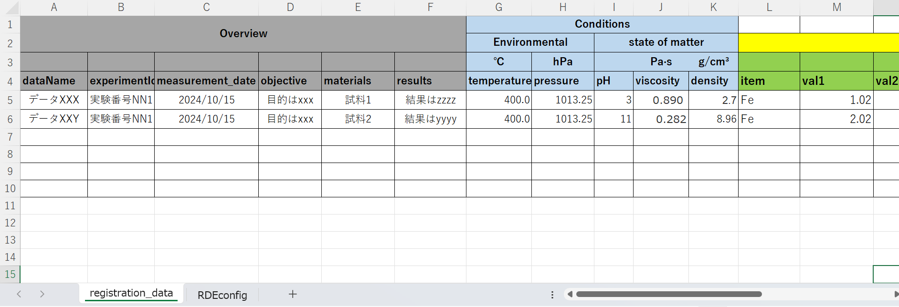
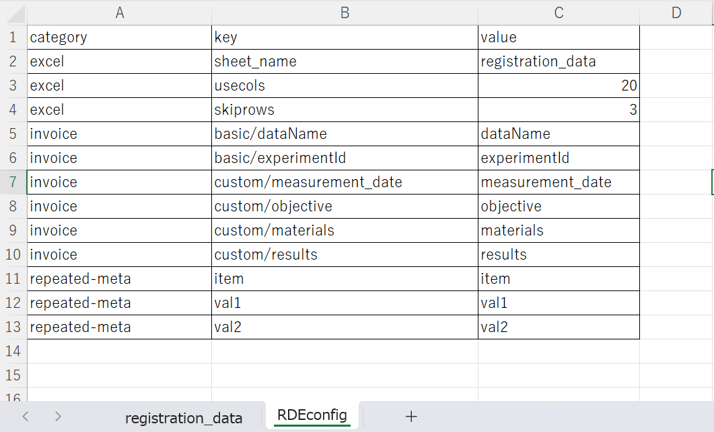
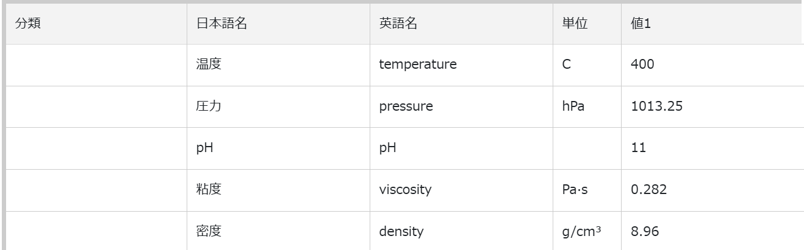
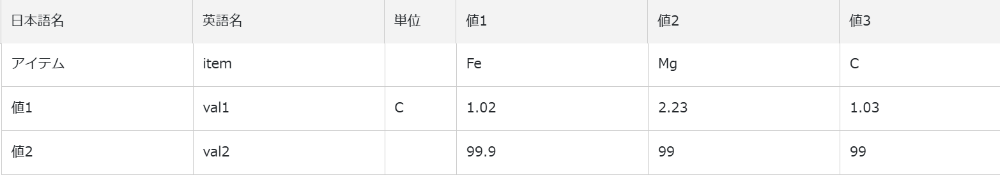

# ELN

## 概要
エクセルファイル形式の電子ラボノート(ELN)をRDEに登録するための標準データセットテンプレートです。
データセットは予め用意されたデータセットテンプレートを元に開設されます。​
ELN標準形式ファイルはエクセル形式で提供され、登録する項目は記述ルールに基づき自由に設定することができます。​
利用者はELN標準形式ファイルを作成、そこに実験情報などを直接入力、または他のELNから転記したものをRDEに登録することができるようになります。


## データタイルの構成要素
### 入力ファイル


||内容|必須|本ドキュメントでの仮名|
|:----|:----|:----|:---|
|1|ELN標準形式ファイル​|〇|入力xlsxファイル|

- ELNでは、入力ファイルに加えて、[invoice.schema.json](#メタ),[metadata-def.json](#メタ)を個別に作成する必要があります。

#### 出力するデータファイル

- 命名規則
  - 拡張子は.xlsx
  - 例
    - elnexcelfile_constant.xlsx
    - elnexcelfile_variable.xlsx
- 備考
  - excel: エクセルデータ<br> 


#### 出力するデータファイル（拡張子以外の命名規則がある場合の例）

- 命名規則
  - ファイルの命名規則はなし


### 出力ファイル
- 入力xlsxファイルは、１つのデータ(データ一覧画面では1タイル)として登録されます。
- .xlsxファイルのシートに記載した1行ごとに、1つのデータとして登録されます。

| ファイル名 | 内容 |備考|
|:----|:----|:----|
|<入力xlsxファイル>.xlsx|電子ラボノート(ELN)ファイル<br>ファイル内には、データシートと[設定シート](#設定シートの説明)の2シート記載。||
|invoice.json|送り状メタと抽出メタの一部が記述されたファイル|[invoice.jsonの詳細](#送り状メタ)|
|metadata.json|ELN標準データセット​テンプレート​で定義された登録データ<br>(ELNの記入行数分出力)<br>|[metadata.jsonの詳細](#登録データ)|


#### 送り状メタ
- invoice.json
```json 
{
    "datasetId": "f66ec1d3-661e-1795-7151-aabf75ff6101",
    "basic": {
        "dateSubmitted": "2024-10-17",
        "dataOwnerId": "119cae3d3612df5f6cf7085fb8deaa2d1b85ce963536323462353734",
        "dataName": "データXXX",
        "instrumentId": "",
        "experimentId": "実験番号NN1",
        "description": ""
    },
    "custom": {
        "measurement_date": "2024-10-15",
        "objective": "目的はxxx",
        "materials": "試料1",
        "results": "結果はzzzz"
    }
}
```
#### 登録データ
- metadata.json
  - 単一出力項目はconstant要素以下に出力する
  - 複数出力項目はvariable要素(配列)以下に出力する
```json 
{
  "constant": {
    "dataName": {
      "value": "データXXX"
    },
    "experimentId": {
      "value": "実験番号NN1"
    },
    "measurement_date": {
      "value": "2024-10-15"
    },
    "objective": {
      "value": "目的はxxx"
    },
    "materials": {
      "value": "試料1"
    },
    "results": {
      "value": "結果はzzzz"
    },
    "temperature": {
      "value": 400
    },
    "pressure": {
      "value": 1013.25
    },
    "pH": {
      "value": 3
    },
    "viscosity": {
      "value": "0.890 "
    },
    "density": {
      "value": 2.7
    }
  },
  "variable": [
    {
      "item": {
        "value": "Fe"
      },
      "val1": {
        "value": 1.02
      },
      "val2": {
        "value": 99.9
      }
    },
    {
      "item": {
        "value": "Mg"
      },
      "val1": {
        "value": 2.23
      },
      "val2": {
        "value": 98.9
      }
    },
    {
      "item": {
        "value": "C"
      },
      "val1": {
        "value": 1.03
      },
      "val2": {
        "value": 99
      }
    }
  ]
}
```
### データ詳細画面/ファイル<br>

| ファイル名 | 内容 |備考|
|:----|:----|:----|
|metadata.json|ELN標準データセット​テンプレート​で定義された登録データ<br>(単一出力項目)||
|metadata.json|ELN標準データセット​テンプレート​で定義された登録データ<br>(複数出力項目)||

### 設定シートの説明

- ELN標準形式ファイルの読み取り方などを指定する設定シート(RDEconfig)の例の説明です。
- 設定シート名は「RDEconfig」としてください。
- 表のvalue項目は例示です。実際のデータに応じて適宜変更してください。

|category |key |value|備考|
|:----|:----|:----|:----|
| excel |sheet_name |registration_data|登録対象のシート名|
| excel |usecols |20|20列目までが読み込み対象|
| excel |skiprows |3|上3行は読み飛ばし、4行目が項目名の行(5行目以降はデータ行)|
|invoice	|basic/dataName	|dataName|送り状のデータ名に転記する場合|
|invoice	|basic/experimentId	|experimentId|送り状の実験IDに転記する場合|
|invoice	|custom/measurement_date	|measurement_date|送り状の実験日に転記する場合|
|invoice	|custom/objective	|objective|送り状の目的に転記する場合|
|invoice	|custom/materials	|materials|送り状の試料に転記する場合|
|invoice	|custom/results	|results|送り状の結果に転記する場合|
|repeated-meta|item|item|複数系列のメタデータ項目がある場合（単一出力項目の場合は不要）|

### メタ

#### 送り状メタ（インボイス項目、手入力メタ）


##### 固有情報
- データ登録の際の手入力の項目を定義するファイル
- 表に示されているパラメータ名は例示であり、数や名称は任意に変更できます。
- ELN標準形式ファイルで設定した項目を元に作成​
- 手入力と電子ラボノート(ELN)ファイルで同じ項目を入力した場合、電子ラボノート(ELN)ファイルが優先されます。

|項目名|必須|日本語名|英語名|type|単位|初期値|備考|
|:----|:----|:----|:----|:----|:----|:----|:----|
|eln_filename||ELNファイル名|eln_filename|string|||入力ファイル名を記入。入力ファイル名を出力する必要がない場合は、記述不要。|
|measurement_date||実験日|measurement_date|string[date]|||yyyy-mm-ddで取得<br>日付項目は、typeとformat指定を組み合わせて定義します。|
|objective||実験目的|objective|string|||実験目的を記入|
|materials||試料|materials|string|||試料名を記入|
|results||実験結果|results|string|||実験結果を記入|

#### invoice.schema.jsonの詳細

- 上記の固有情報に沿ったJSONスキーマの事例
- データの登録処理においてinvoice.schema.jsonの定義に合致しない場合は登録エラーとなります。
- キー名以降の項目の説明を下表に示します。

|項目(JSONポインタ表現)|必須|説明|
|:----|:----|:----|
|label|〇|表示するフィールド名や説明を定義。|
|label/ja|〇|項目名の日本語表記|
|label/en|〇|項目名の英語表記|
|type|〇|項目のデータ型を定義。|
|format||文字列のフォーマット。"date","time","uri","uuid","markdown"のいずれか一つを指定。いずれの場合もnullを許容しない。|
|options||項目に関するオプションの指定。|
|widget||画面部品を明示的に指定する。"textarea"のみ指定可能|
|rows||画面部品が"textarea"の場合の行数を指定する。|
|placeholder||フィールドに入力する前に表示されるヒントやサンプルテキスト|
|placeholder/ja||項目名の日本語表記|
|placeholder/en||項目名の英語表記|
```json
{
    "$schema": "https://json-schema.org/draft/2020-12/schema",
    "$id": "https://rde.nims.go.jp/rde/dataset-templates/ELNstandard_dataset_template_sample/catalog.schema.json",
    "description": "None",
    "type": "object",
    "required": [
        "custom"
    ],
    "properties": {
        "custom": {
            "type": "object",
            "label": {
                "ja": "固有情報",
                "en": "Custom Information"
            },
            "required": [],
            "properties": {
                "eln_filename": {
                    "label": {
                        "ja": "ELNファイル名",
                        "en": "eln_filename"
                    },
                    "type": "string",
                    "options": {
                        "placeholder": {
                            "ja": "入力ファイル名を記入",
                            "en": "Fill in the eln_filename."
                        }
                    }                    
                },
                "measurement_date": {
                    "label": {
                        "ja": "実験日",
                        "en": "measurement_date"
                    },
                    "type": "string",
                    "format": "date"
                },
                "objective": {
                    "label": {
                        "ja": "実験目的",
                        "en": "objective"
                    },
                    "type": "string",
                    "options": {
                        "widget": "textarea",
                        "rows": 5,
                        "placeholder": {
                            "ja": "実験目的を記入",
                            "en": "Fill in the objective."
                        }
                    }
                },
                "materials": {
                    "label": {
                        "ja": "試料",
                        "en": "materials"
                    },
                    "type": "string",
                    "options": {
                        "placeholder": {
                            "ja": "試料名を記入",
                            "en": "Fill in the materials."
                        }
                    }
                },
                "results": {
                    "label": {
                        "ja": "実験結果",
                        "en": "results"
                    },
                    "type": "string",
                    "options": {
                        "widget": "textarea",
                        "rows": 5,
                        "placeholder": {
                            "ja": "実験結果を記入",
                            "en": "Fill in the results."
                        }
                    }
                }
            }
        }
    }
}
```

### 抽出メタ（構造化処理で抽出するメタ）
- 電子ラボノート(ELN)ファイルから抽出するメタ
- 表に示されているパラメータ名は例示であり、数や名称は任意に変更できます。

|パラメータ名|取得元|RDE2.0 日本語名|RDE2.0 英語名|type|単位|初期値|備考|
|:----|:----|:----|:----|:----|:----|:----|:----|
|temperature||温度|temperature|number|C||単一出力項目|
|pressure||圧力|pressure|number|hPa||単一出力項目|
|pH||pH|pH|number|||単一出力項目|
|viscosity||粘度|viscosity|number|Pa·s||単一出力項目|
|density||密度|density|number|g/cm³||単一出力項目|
|item||アイテム名|item|string|||複数出力項目|
|val1||変数1|val1|number|C||複数出力項目|
|val2||変数2|val2|number|||複数出力項目|

#### metadata-def.jsonの詳細
- 上記の抽出メタ情報に沿ったメタデータ定義の事例
- 複数出力項目はメタデータ定義でvariable=1指定をする
- variableの指定がないものは、メタデータではconstant要素の子要素として出力されます。

|項目(JSONポインタ表現)|必須|説明|
|:----|:----|:----|
|name|〇|項目の名前。日本語 (ja) と英語 (en) の両方を指定できます。|
|name/ja|〇|項目名の日本語表記|
|name/en|〇|項目名の英語表記|
|schema|〇|項目のデータ型を定義します。|
|type|〇|メタデータの値の型|
|format||文字列のフォーマット|
|unit||項目の単位|
|order||項目の表示順序|
|variable||項目が複数表示される場合指定する。（必要に応じて、数値や設定の状態によって使います。）|

```json
{
    "temperature": {
        "name": {
            "ja": "温度",
            "en": "temperature"
        },
        "schema": {
            "type": "number"
        },
        "unit": "C",
        "order": 1
    },
    "pressure": {
        "name": {
            "ja": "圧力",
            "en": "pressure"
        },
        "schema": {
            "type": "number"
        },
        "unit": "hPa",
        "order": 2
    },
    "pH": {
        "name": {
            "ja": "pH",
            "en": "pH"
        },
        "schema": {
            "type": "number"
        },
        "order": 3
    },
    "viscosity": {
        "name": {
            "ja": "粘度",
            "en": "viscosity"
        },
        "schema": {
            "type": "number"
        },
        "unit": "Pa·s",
        "order": 4
    },
    "density": {
        "name": {
            "ja": "密度",
            "en": "density"
        },
        "schema": {
            "type": "number"
        },
        "unit": "g/cm³",
        "order": 5
    },
    "item": {
      "name": {
        "ja": "アイテム",
        "en": "item"
      },
      "schema": {
        "type": "string"
      },
      "order": 6,
      "variable": 1
    },
    "val1": {
      "name": {
        "ja": "値1",
        "en": "val1"
      },
      "schema": {
        "type": "number"
      },
      "unit": "C",
      "order": 7,
      "variable": 1
    },
    "val2": {
      "name": {
        "ja": "値2",
        "en": "val2"
      },
      "schema": {
        "type": "number"
      },
      "order": 8,
      "variable": 1
   }
}
```
### データカタログ項目

- データカタログの項目です。データカタログはデータセット管理者がデータセットの内容を第三者に説明するためのスペースです。

|RDE2.0用パラメータ名|日本語語彙|英語語彙|データ型|備考|
|:----|:----|:----|:----|:----|
|catalog|データカタログ|Data Catalog|object||
|dataset_title|データセット名|Dataset Title|string||
|abstract|概要|Abstract|string||
|data_creator|作成者|Data Creator|string||
|language|言語|Language|string||
|experimental_apparatus|使用装置|Experimental Apparatus|string||
|data_distribution|データの再配布|Data_Distribution|string||
|raw_data_type|データの種類|Raw Data Type|string||
|stored_data|格納データ|Stored Data|string||
|remarks|備考|Remarks|string||
|references|参考論文|References|string||


## 構造化処理の詳細

### eln_module関数の説明
- xlsx形式のデータを使用した構造化処理を行います。以下関数内で行っている処理の説明です。
```python
def eln_module(
    srcpaths: RdeInputDirPaths, resource_paths: RdeOutputResourcePath,
) -> None:
```
#### インスタンスの作成

- コーディネーターインスタンス
```python    
    module = ELNProcessingCoordinator(
        FileReader(), MetaParser(),
    )
``` 
#### 設定シートの読み込み
- [設定ファイル](#設定シートの説明)を呼び出し、categoryが"invoice"の行のみを抽出
```python
        module.file_reader.check(srcpaths)
        invoice_meta_path = srcpaths.tasksupport / "invoicemeta.csv"
        df = pd.read_csv(invoice_meta_path)
        temp = df.query('category == "invoice"')            
```            
#### ファイルの読み込み
- read_invoiceで、画面の入力項目を読み込む
```python
        rawfile = resource_paths.rawfiles[0]
        invoice_obj = module.file_reader.read_invoice(resource_paths.invoice_org)
```
- /appというディレクトリが存在すれば、source_pathを./app/empty_metadata.jsonに設定（本番環境での実行）
- 存在しなければ、カレントディレクトリの./empty_metadata.jsonを使用（ローカル環境での実行）

```python
        empty_meta_path = Path("/app/empty_metadata.json") if Path("/app").exists() else Path("./empty_metadata.json")
```
#### 送り状(invoice.json)の上書き
- もしrawfileが*_meta.json(1行ごとのメタデータを抽出した一時ファイル)があれば、divided/[NNN]/metaフォルダ以下にmetadata.jsonとしてコピーする。
- なければ、empty_metadata.jsonをmetadata.jsonとしてコピーする
- 必要に応じて、送り状データ(invoice.json)の上書き

```python
        if str(rawfile).endswith("_meta.json"):  # *_meta.jsonはdivide.pyで出力される1行分のデータ
            with open(str(rawfile), encoding="utf-8") as f:
                d = json.load(f)
            module.meta_parser.save_empty_meta(resource_paths)
            module.file_reader.overwrite_invoice(
                temp, d, invoice_obj, resource_paths.invoice.joinpath("invoice.json"),
            )
        else:
            shutil.copy(
                empty_meta_path, str(resource_paths.meta) + "/metadata.json",
            )
            module.file_reader.overwrite_invoice_for_original(
                invoice_obj, resource_paths.invoice.joinpath("invoice.json"),
            )
```

